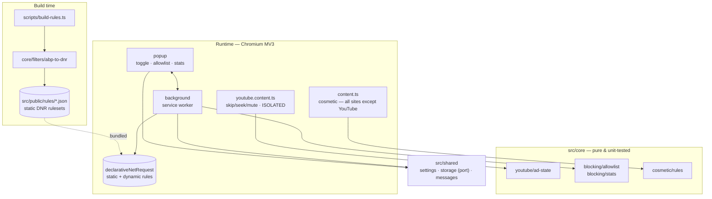
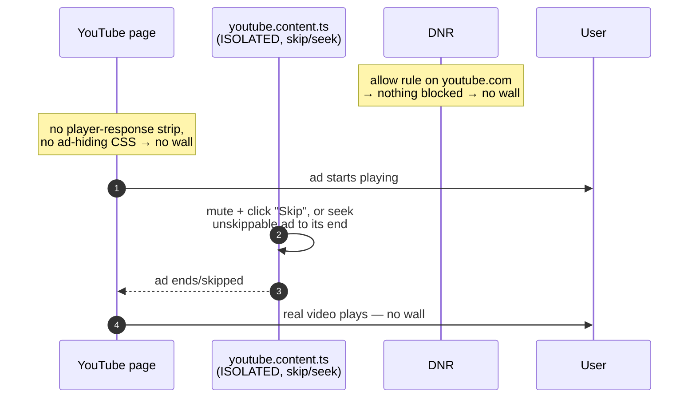
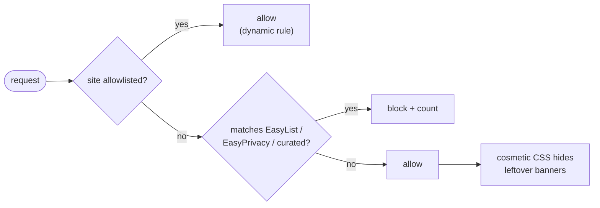

# full-blocker

Ad, banner and tracker blocker for **Chromium** (Chrome / Brave / Edge),
Manifest V3 — with a special focus on **handling YouTube ads without triggering
the anti-adblock wall**. Personal use, loaded as an unpacked extension.

## How it works (overview)
- **Network** (`declarativeNetRequest`): rulesets generated from EasyList +
  EasyPrivacy plus a curated ruleset. Blocks ad/tracker requests on every site.
- **YouTube** (content script): DNR cannot block YouTube ads (they come from the
  same domains as the video), and YouTube's anti-adblock detects *any* attempt to
  make ads not exist — both blocking/removing them **and** hiding their containers
  with CSS trip the "ad blockers violate ToS" wall (after which the server 403s
  every `videoplayback` request). So on YouTube we deliberately **(a)** keep DNR
  from blocking anything, **(b)** inject no ad-hiding CSS, and **(c)** let the ad
  load and play, then auto **skip / fast-forward / mute** it. YouTube only sees a
  very fast "skip" click, which it does not treat as ad blocking. The ad-decision
  logic lives in `src/core/youtube/ad-state.ts` and is fully unit-tested.
- **Cosmetic** (content script): CSS that hides common ad containers/banners on
  all sites **except YouTube** (see above).
- **Popup**: global on/off, per-site allowlist, and a per-tab breakdown of what
  was blocked (with a count badge on the toolbar icon).

> On YouTube the blocked count is intentionally **0**: nothing is blocked at the
> network level there — video ads are skipped client-side. On other sites the
> count reflects real network blocking.

## Architecture

Clean-ish layering: a **pure, testable domain** (`src/core`, no `chrome.*`), a
small **ports** layer (`src/shared`), and **adapters** (`src/entrypoints`) that
wire the domain to the browser APIs. Static DNR rulesets are produced at build
time from filter lists.



### Why YouTube needs a different strategy

DNR can't block YouTube video ads (same domains as the video), and YouTube's
anti-adblock trips its wall on *any* sign that ads were removed — blocking
requests, stripping the player response, or hiding ad containers with CSS all
get detected (the server then 403s every `videoplayback` request). The only
approach that survives is to let the ad play and **skip/fast-forward** it.



### Request handling on a normal site



### Settings (persisted via `chrome.storage`)

```ts
type Settings = {
  enabled: boolean            // global on/off
  allowlist: string[]         // registrable domains exempt from blocking
  youtube: { enabled: boolean }
  cosmetic: { enabled: boolean }
}
```

## Requirements
- Node 24 (via fnm — see `.node-version`) and pnpm (`corepack pnpm`).

## Development
```bash
corepack pnpm install      # install deps (+ wxt prepare)
corepack pnpm run rules    # download EasyList/EasyPrivacy → src/public/rules/*.json
corepack pnpm test         # run the core unit tests
corepack pnpm run build    # generate rules + build the extension into .output/chrome-mv3
corepack pnpm dev          # dev mode with HMR
```
> If pnpm complains about "ignored build scripts", the esbuild binary already
> ships via its platform package; run the commands through
> `./node_modules/.bin/<cmd>` or approve them with `pnpm approve-builds`.

## Load it in the browser (unpacked)
1. `corepack pnpm run build`
2. Open `chrome://extensions` (or `brave://extensions`, `edge://extensions`).
3. Enable **Developer mode**.
4. **Load unpacked** → select the `.output/chrome-mv3` folder.
   > It's a hidden folder (leading dot). In the macOS file dialog press
   > `⌘ + Shift + .` to reveal hidden folders, or `⌘ + Shift + G` and paste the
   > full path.

After editing code, run the build again and click the ↻ (reload) button on the
extension card, or use `corepack pnpm dev` for auto-reload.

## Notes & limits
- Chrome guarantees **30,000 enabled static rules**; the caps in
  `scripts/build-rules.ts` keep the total (~29k) under that so every ruleset
  loads reliably. The script reports how many rules were dropped (no silent
  truncation).
- Blocking YouTube ads is a cat-and-mouse game: when YouTube changes its player,
  adjust the selectors in `src/core/cosmetic/rules.ts` and the logic in
  `src/core/youtube/` (covered by tests).
- If the wall sticks around after a fix, clear youtube.com site data
  (DevTools → Application → Clear site data, which also clears the service
  worker) and hard-reload.
- Possible v2: whole-network DNS layer, ingest EasyList cosmetic rules at build
  time, periodic filter-list updates.

## Project structure
```
src/core/         pure, testable domain (youtube, blocking, cosmetic, filters)
src/shared/       settings, storage (port), typed message contracts
src/entrypoints/  background, content, youtube(.content/-main), popup (adapters)
src/public/rules/ DNR rulesets (curated is versioned; easylist/easyprivacy generated)
scripts/          build-rules.ts (filter lists → DNR)
tests/            core specs
```
